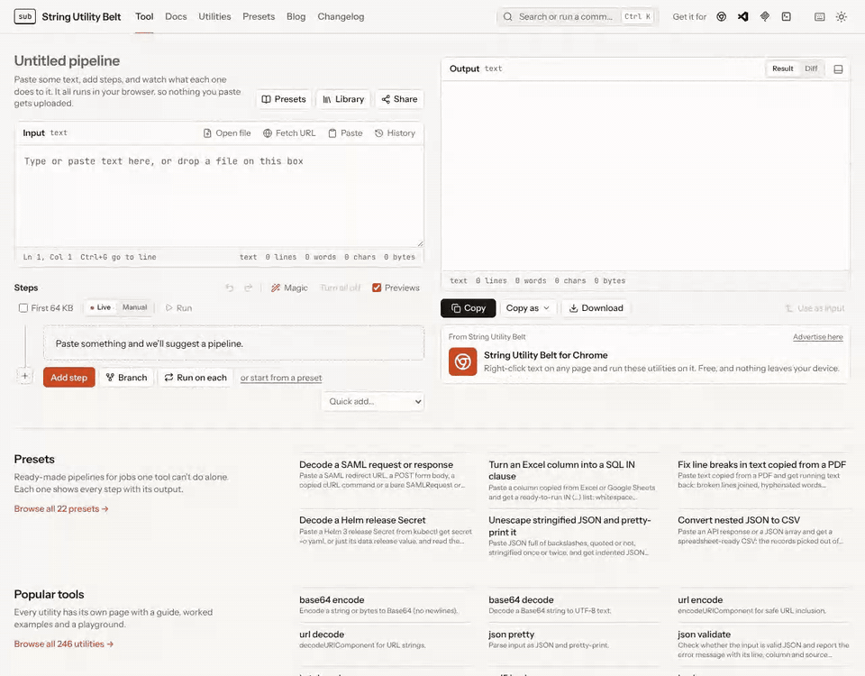

# String Utility Belt

[](https://github.com/String-Utility-Belt/string-utility-belt/actions/workflows/ci.yml)
[](LICENSE)
[](https://www.npmjs.com/package/subelt)
[](https://smithery.ai/servers/string-utility-belt/string-utility-belt)
[](https://github.com/sponsors/Murraylr)

**[stringutilitybelt.com](https://stringutilitybelt.com)** · [Usage guide](https://stringutilitybelt.com/docs/) · [All utilities](https://stringutilitybelt.com/utilities/) · [Integrations](https://stringutilitybelt.com/integrations/)

Chain string transformations into visual pipelines with live, per-step previews. 246 utilities —
encodings, hashes, ciphers, compression, data formats (JSON/YAML/TOML/CSV/XML), line and text
operations, analysis, generators, web/dev helpers, numbers, dates and colours — all running
client-side, with the same engine available as a CLI, an HTTP API, an MCP server, a browser
extension and a VS Code extension.

[](https://stringutilitybelt.com)

## Use it from your agent, terminal or editor

Every utility also runs on your own machine, outside the browser:

```bash
# Give Claude Code (or any MCP client) exact hashing, encoding and decoding instead of a guess
claude mcp add subelt -- npx -y @string-utility-belt/mcp

# Pipe text through a pipeline from the shell
echo 'eyJ1c2VyIjoiYWRhIn0=' | npx subelt base64_decode json_pretty
```

- **MCP server** — [`@string-utility-belt/mcp`](packages/mcp/README.md): five tools (search, describe, run a
  utility, run a pipeline, detect a format); config for Claude Desktop, Cursor and other clients in its README.
- **CLI** — [`subelt`](packages/cli/README.md): steps as arguments, stdin to stdout, share links and pipeline files.
- **Editors and browsers** — the [VS Code extension](https://marketplace.visualstudio.com/items?itemName=stringutilitybelt.string-utility-belt)
  (also [on Open VSX](https://open-vsx.org/extension/stringutilitybelt/string-utility-belt) for Cursor and VSCodium) and the
  [Chrome extension](https://chromewebstore.google.com/detail/string-utility-belt/onmlbgadajghegkcpkkhlmmognihjfbh?utm_source=github&utm_medium=referral).
- **Library** — [`@string-utility-belt/core`](packages/core/README.md), the engine with every utility, for your own code.

## Features

- **Pipelines** — add, reorder (drag and drop), duplicate, disable/solo steps; undo/redo; per-step
  previews, diffs, timings and error policies (pass through / stop / empty); conditional steps;
  parallel branches with concat/zip/json/pick merges; macros (collapse a sub-chain into one step);
  "run on each" steps (run a sub-chain on every line, delimited piece, JSON array element or object value).
- **Share and save** — pipelines (and optionally the input) as compressed `#/p/…` links, a named
  pipeline library with JSON import/export, a preset gallery, an embeddable `#/embed/…` widget.
- **Magic** — detects the input's format (base64, JWT, gzip, JSON, …) and suggests or appends the
  decoding step; "decode until stable" mode.
- **Input/output** — file upload (text and binary), fetch-a-URL via the Worker proxy, input history,
  side-by-side and diff views, hex view for bytes, syntax highlighting, stats bar, smart download
  names, copy-as (raw / JSON literal / hex / base64).
- **Engine** — runs in a Web Worker with cancellation, adaptive debounce, a chunked mode for
  multi-MB inputs and a preview-first-64 KB option; custom JavaScript steps run in a sandboxed,
  network-less iframe + worker, and are quarantined when they arrive from someone else's link.
- **App** — command palette (Ctrl+K), keyboard shortcuts (`?`), fuzzy utility search with
  favourites/recents and type-aware badges, light/dark themes, per-utility doc pages with a live
  playground, installable PWA with offline support and an OS share target, i18n scaffold.

## Using the app

Open [stringutilitybelt.com](https://stringutilitybelt.com) — nothing to install, and every
transformation runs in your browser (see the [privacy policy](https://stringutilitybelt.com/privacy/)
for the few features that contact the server). The site sets no cookies and runs no tracking
scripts: Cloudflare Web Analytics counts page views without cookies, the site's own server counts
clicks on sponsor and tool links by id alone, neither ever receives what you paste, and the site's
Content-Security-Policy blocks scripts from anywhere else. The how-to guide lives in the app
itself: click **Docs** in the header, or go to [`/docs/`](https://stringutilitybelt.com/docs/). Each
utility's settings and examples are on its own page, listed at
[`/utilities/`](https://stringutilitybelt.com/utilities/).

From a terminal, the same engine is one command away:

```bash
echo -n hello | npx subelt trim base64_encode hash   # SHA-256 of the base64
```

## Development

Requires Node.js 20.19+ or 22.12+.

```bash
git clone https://github.com/String-Utility-Belt/string-utility-belt.git
cd string-utility-belt
npm ci
npm run dev          # generates the utility manifest, then starts Vite
npm test             # Vitest (unit, component, golden-example and property tests)
npm run lint
npm run typecheck
```

| Command | What it does |
| --- | --- |
| `npm run gen` | Regenerate `src/utilities/_generated/*` (run automatically before `dev`/`build`) |
| `npm run build` | Production build of the web app |
| `npm run check:bundle` | Enforce the entry-chunk budget in `bundle-budget.json` |
| `npm run build:seo` | Pre-render utility pages, sitemap, RSS and OG images into `dist/` (`build:seo:fast` skips OG images) |
| `npm run build:site` | `build` + `build:seo` |
| `npm run build:tools` | Build `packages/*` (core, CLI, MCP server, browser extension, VS Code extension) |
| `npm run test:e2e` | Playwright end-to-end tests against a production build |
| `npm run bench` | Large-input benchmarks (`vitest bench`) |
| `npm run deploy` | `build:site`, then `wrangler deploy` (Cloudflare Workers: static assets + `/api/*`) — releases normally deploy from CI |
| `npm run release -- plan` | What a release from `HEAD` would ship, and at which versions ([RELEASING.md](RELEASING.md)) |
| `npm run readme:demo` | Re-record this README's demo GIF from the production build (after `npm run build`; needs ffmpeg) |

## Other surfaces

| Surface | Where | Notes |
| --- | --- | --- |
| Core library | [`packages/core`](packages/core/README.md) | Framework-free engine + all utilities |
| CLI | [`packages/cli`](packages/cli/README.md) | `echo -n hello \| subelt base64_encode` |
| MCP server | [`packages/mcp`](packages/mcp/README.md) | Utilities and pipelines as agent tools over stdio |
| HTTP API | [`worker/`](worker/api.ts) | `POST /api/run`, `GET /api/utilities[/:id]` (CORS, rate-limited) |
| Browser extension | [`packages/extension`](packages/extension/README.md) | MV3; context menu "run on selection" |
| VS Code extension | [`packages/vscode`](packages/vscode/README.md) | Transform selection, run a share link |

## Support the project

String Utility Belt is free, open source and has no paid tier. If it saves you time, you can support its
development through [GitHub Sponsors](https://github.com/sponsors/Murraylr): it pays for hosting and keeps new
utilities, presets and fixes coming. Companies can also [sponsor a page on the site](https://stringutilitybelt.com/advertise/).

## Contributing

Contributions are welcome — bug reports, utility ideas and pull requests. Start with
[CONTRIBUTING.md](CONTRIBUTING.md) (setup, adding a utility, PR checklist) and the
[Code of Conduct](CODE_OF_CONDUCT.md). [CLAUDE.md](CLAUDE.md) is the detailed architecture reference.

Found a security issue? Please report it privately — see [SECURITY.md](SECURITY.md).

## License

[MIT](LICENSE)
